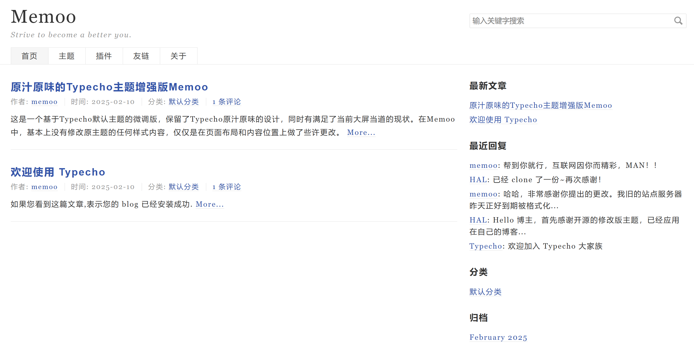

# Memoo

这是一个基于Typecho默认主题的微调版，保留了Typecho原汁原味的设计，同时有满足了当前大屏当道的现状。

在Memoo中，基本上没有修改原主题的任何样式内容，仅仅是在页面布局和内容位置上做了些许更改。

## 主要改动

这里，我将详细的介绍本主题对原主题的改动。

### 布局改动

Typecho默认的主题，在屏幕的两侧有大量的空白，现在计算机屏幕分辨率都非常高，默认的外观对高分辨率不友好。

当前主题采取尽量占据整个屏幕的设计理念，尽可能的占满整个屏幕。

页面使用双栏布局，内容和侧栏比例为8:4。

### 位置改动

“上一篇”和“下一篇”的位置，由页面底部调整到了紧挨着文章内容的下方，同时将上下布局修改为了左右布局，更符合使用习惯。

评论表单由原来的页面底部提升到了文章内容下面，在评论列表的上方，阅读完文章内容之后，就可以立即评价。

将评论列表放置在了页面的最下方。

### 样式改动

为了更符合中文阅读习惯，本主题将字间距调大了（`1.5px`），要不然中文过于紧凑会提高阅读难度。

同时，将行间距由原来的1.5调整为现在的1.8，进一步提升文字之间的间隔，提高可读性。

最后，将搜索框的长度由原来的内容的四分之一，调整为当前的三分之一，更加修长。

## 引用文件

默认主题使用了来源于github的一个开源页面栅格系统（`grid.css`），经过作者观察，该系统过于老旧，仅支持最高1200宽度的屏幕，在1200以上的屏幕都会有两侧的大量空白。

为了提高工作效率，本主题以CDN的形式引入了Bootstrap的网格系统文件（`bootstrap-grid.css`，注意这里没有引用整个Bootstrap包）。

我相信使用Typecho系统的大部分同志都是非常在意网页加载速度的，因此，使用本主题不用有资源过大，降低页面加载速度的疑虑。

## 结语

最后，如果有使用上的问题，可以评论留言。
